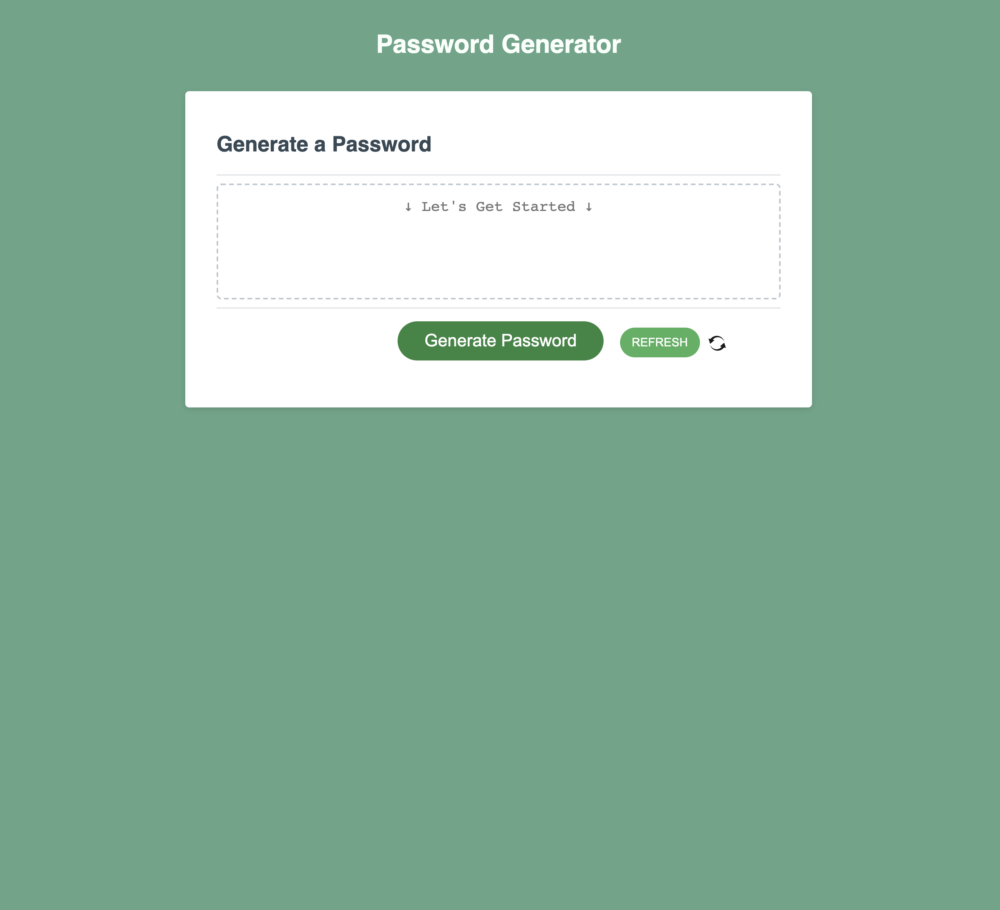

# Module 3 Challenge - Random Password Generator
## Description

Cybersecurity is important but having to create a strong password on your own can be difficult and take up time from your day. By using this simple <a href="https://samanthashleyrose.github.io/module03-challenge/">Random Password Generator</a> you'll have a brand new password within seconds that will not only meet your security needs but also save you a headache.

By refactoring the provided starter code, I was able to make the site function properly and prepare for any issues it may encounter along the way (such as inaccurate password length selection). I also made small changes to the HTML & CSS to overall add to the design. Throughout this process I learned the value of:
 - Appropriately naming variables/functions
    - It's easy to get lost in your code, especially if the names of your content are too similar. By accurately portraying the purpose of your variable or function you are making it easier for yourself and others to read your code.
 - Layout & Single-line comments
    - During this project, I have found when I place a descriptive comment above each section it helps to organize the layout. With these labels I am able to place the sections in the order in which they should ideally be happening on the site. This simplifies the process of identifying where any bugs may be or where I need to go to introduce new code. 
    - As a new developer, I'm constantly learning new vocabulary and concepts. As I went through the script.js I used single-line comments to notate definitions and/or what was being done. This makes it much easier to comprehend how the JS concepts are impacting each other while working through the code.

## Table of Contents

- [Usage](#usage)
- [Credits](#credits)
- [Features](#features)

## Installation

N/A

## Usage

The beauty of this site is it's simple to use!

Begin by pressing 'Generate Password' which will open multiple prompt boxes at the top of the page. Follow the instructions and answer the questions based off your passwords needs. Once you've answered every prompt, a random password will be generated in the text box. Just highlight, copy/paste, and you're good to go! For greater security, it's recommended the password is stored in a safe place such as a locked passwords folder or written down on a piece of paper only you have access to. 
(See [Features](#features) below for a demonstration on how to use the *Refresh* button)

## Credits

#### Knowledge Assitance From:
<li>Lee Warrick <link><a href="https://leewarrick.com/">Personal Portfolio</a></link></li>
<li>Mia Ciasullo <link><a href="https://github.com/miacias/first-portfolio">GitHub Portfolio</a></link></li>
<li>Faran Navazi (Tutor) <link><a href="https://github.com/FaranNavazi">GitHub Portfolio</a></link></li>
<li>Nicole Choiniere-Kroeker (Classmate) <link><a href="https://github.com/nchoin">GitHub Portfolio</a></link></li>

#### Documentation Used:

<li><link><a href="https://chat.openai.com/">ChatGPT</a></link></li>
<li><link><a href="https://www.w3schools.com/js/js_popup.asp">W3Schools JS Popup Boxes</a></link></li>
<li><link><a href="https://www.w3schools.com/jsref/met_win_prompt.asp">W3Schools Window Prompt()</a></link></li>
<li><link><a href="https://www.w3schools.com/howto/howto_css_animate_buttons.asp">W3Schools How To - Animate Buttons</a></link></li>
<li><link><a href="https://www.codecademy.com/resources/docs/javascript/loops">Codecademy JavaScript Concepts</a></link></li>
<li><link><a href="https://www.reddit.com/r/AskProgramming/comments/katbot/javascript_help_with_password_generator/">Javascript help with Password Generator - Reddit</a></link></li>
<li><link><a href="https://www.youtube.com/watch?v=x4HUaiazDes">Homework Startup Guide - JavaScript Password Generator - YouTube</a></link></li>
<li><link><a href="https://www.youtube.com/watch?v=v2jfGo7ztm8">Random Password Generator in JavaScript
- YouTube</a></link></li>

## Features

Let's say you've entered in all the needed criteria into the prompt boxes and you have a generated password sitting in the textbox... but you don't like how it looks. That's where the Refresh Feature comes in handy! Go ahead and press the 'Refresh' button located next to 'Generate Password' to have a freshly mixed batch of random characters!

https://github.com/samanthashleyrose/module03-challenge/assets/142939966/b067049e-0dec-4bf6-ab21-6a4a79ce2062

## License

Please refer to the MIT LICENSE in the repo.    !
